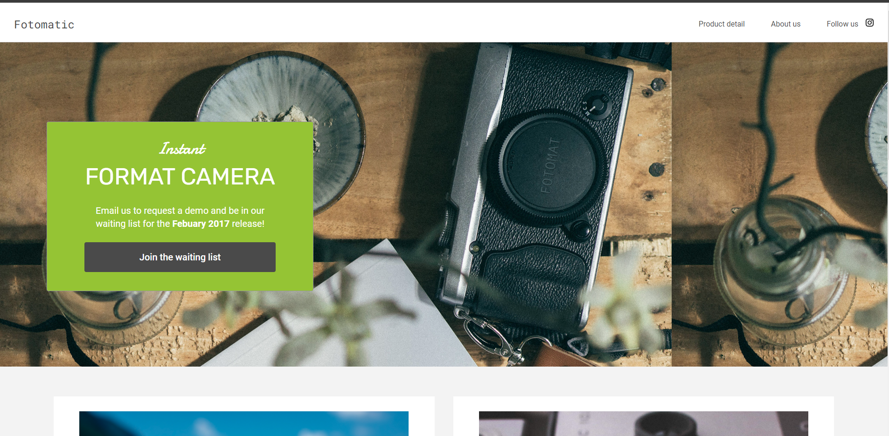

# Photography Website

## Description

## **_Note: This is a project from codecademy_**.

A website made for photography, to showcase an ability to fix basic html and css website with flexbox and media queries.

### Preview
<!-- you can't have spaces in your preview image btw -->

<!-- One way to do it -->
<!--  -->

<!-- another way (and you can set width) -->

### Languages used

- HTML
- CSS

##### Note

- I do not hold any copyrights
